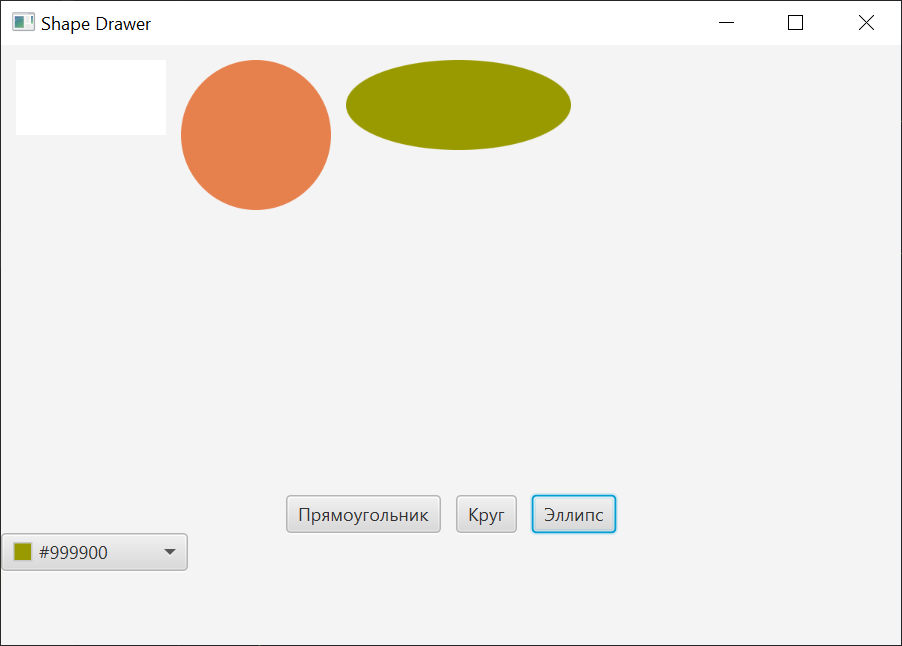
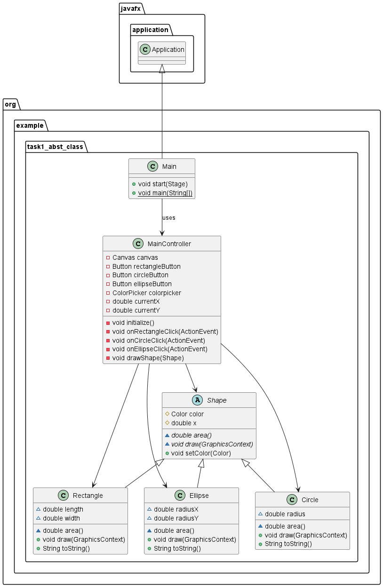

# Shape Drawer 

## Описание

Shape Drawer - это приложение, разработанное на JavaFX для демонстрации основных принципов объектно-ориентированного программирования и работы с графическим интерфейсом пользователя.  Он позволяет пользователям рисовать простые геометрические фигуры (прямоугольники, круги, эллипсы) разных цветов.  Проект предназначен для обучения и демонстрации концепций абстрактных классов, наследования.

Этот проект решает проблему необходимости простого и понятного примера для освоения основ объектно-ориентированного программирования.  
#### Технологический стек

*   **Язык программирования:** Java 17+
*   **Фреймворк:** JavaFX
*   **Инструмент разработки UI:** Scene Builder
*   **Система сборки:** Maven

##### Статус

Бета-версия.  Текущая функциональность ограничена рисованием фигур.  

#### Ссылка на продукт
[Shape Drawer ](https://github.com/vlml01/Task1_abstr_class)


#### Отличительные черты

Shape Drawer фокусируется на простоте и понятности, что делает его идеальным инструментом. В отличие от сложных приложений, он не перегружен функциональностью и позволяет быстро и легко рисовать фигуры разных цветов.

  


## Архитектура
 

## Зависимости

*   Java Development Kit (JDK) 17 или выше.
*   Apache Maven.
*   Scene Builder (рекомендуется для редактирования FXML файлов).

## Установка

1.  **Клонирование репозитория:**

    ```bash
    git clone [ссылка на ваш репозиторий]
    cd [имя папки вашего репозитория]
    ```

2.  **Сборка проекта с помощью Maven:**

    ```bash
    mvn clean install
    ```

3.  **Запуск приложения:**

    ```bash
    mvn javafx:run
    ```

    Или запустите `Main.java` файл из вашей IDE.
## Конфигурация
Конфигурация не требуется.

## Применение
Запустите приложение. Выберите цвет и нажмите кнопку, чтобы нарисовать нужную фигуру.
## Получение справочной информации

Если у вас есть вопросы, проблемы, или вы хотите сообщить об ошибке, пожалуйста, дайте нам знать: [Создать сообщение](https://github.com/vlml01/Task1_abstr_class/issues)
## Приглашение к сотрудничеству

 Мы открыты для любых идей и предложений по улучшению функциональности, дизайна и удобства использования.

Не стесняйтесь создавать сообщения с вашими предложениями или задавать вопросы.

